<div align="center">

<!-- Bannière animée avec typing effect -->


<!-- Typing SVG -->
<a href="https://git.io/typing-svg"></a>

<br>

<!-- Badges sociaux animés -->
<a href="mailto:simeoncephasamoussou@gmail.com">
  
</a>
<a href="https://www.linkedin.com/in/sim%C3%A9on-c%C3%A9phas-amoussou-0ba010368/">
  
</a>
<a href="https://github.com/Cephas-67">
  
</a>


<br><br>

<!-- Compteur de visiteurs animé -->


</div>

<br>

<!-- Ligne de séparation animée -->


<br>

##  **À Propos de Moi**


```yaml
nom: Siméon Céphas AMOUSSOU
localisation: ["Cotonou", "Bénin", "🇧🇯"]
formation: "Licence en Génie Logiciel (2ème année)"
université: "IFRI-UAC"
spécialisation_future: "DevOps"

rôles:
  - Développeur Web/Mobile Junior
  - Designer UI/UX
  - Graphiste Adobe Suite
  - Marketing Digital

passion:
  - "Créer des solutions numériques innovantes"
  - "Résoudre des problèmes réels avec le code"
  - "Designer des interfaces élégantes"
  
langues: ["Français 🇫🇷", "English 🇬🇧", "Fon", "Yoruba"]

hobbies: 
  - Jeux vidéos 🎮
  - Lecture 📚
  - Documentaires 🎬
  - Musique 🎵
  - Sports ⚽
  - Échecs 🏛️

currently_learning: 
  - Docker & Kubernetes
  - CI/CD Pipelines
  - Cloud Computing (AWS/Azure)
  - Infrastructure as Code
```

<br><br>

<!-- Ligne de séparation -->


<br>

##  **Mes Compétences Techniques**

<div align="center">

### 🎨 **Frontend Development**


### ⚙️ **Backend Development**


### 🎨 **Design & Creative Tools**


### 🔧 **DevOps & Tools**


</div>

<br>

<!-- Ligne de séparation -->


<br>

## 💼 **Projets Phares**

<div align="center">

<!-- Projet 1 -->
<a href="https://github.com/Cephas-67/ifri-comotorage">
  
</a>

<!-- Projet 2 -->
<a href="https://github.com/Cephas-67/dekoun">
  
</a>

<!-- Projet 3 -->
<a href="https://github.com/Cephas-67/elo-benin">
  
</a>

<!-- Projet 4 -->
<a href="https://github.com/Cephas-67/dhcp-server">
  
</a>

</div>

<br>

### 🚗 **IFRI Comotorage**
**Plateforme de covoiturage universitaire**  
`Vue.js` • `Django` • `SQLite` • `REST API`

Application web permettant aux étudiants d'IFRI de partager leurs trajets quotidiens, réduisant les frais de déplacement. Système de matching intelligent entre conducteurs et passagers.

---

### 🛍️ **DEKOUN - E-commerce**
**Boutique en ligne de produits alimentaires**  
`React` • `Django REST Framework` • `Payment Gateway` • `Responsive Design`

Plateforme e-commerce moderne pour la vente de purée de sauce graine. Interface utilisateur intuitive avec panier d'achat, gestion des commandes et paiement sécurisé.

---

### 🏠 **e-lo Bénin**
**Solution digitale de location immobilière**  
`TypeScript` • `Vue.js` • `Django` • `PostgreSQL` • `Google Maps API`

Plateforme innovante modernisant la recherche et location immobilière au Bénin. Système de filtres avancés, géolocalisation et mise en relation directe propriétaires-locataires.

---

### 🖥️ **Serveur DHCP**
**Infrastructure réseau et administration système**  
`Windows Server` • `ISC DHCP` • `Networking` • `Active Directory`

Configuration complète d'un serveur DHCP pour gestion automatisée des adresses IP dans un environnement réseau local d'entreprise.

<br>

<!-- Ligne de séparation -->


<br>

## 📊 **GitHub Analytics**

<div align="center">

<!-- Stats principales -->


<!-- Langages les plus utilisés -->


</div>

<br>

<div align="center">

<!-- GitHub Streak -->


</div>

<br>

<div align="center">

<!-- Graphique d'activité -->


</div>

<br>

<div align="center">

<!-- Trophées GitHub -->


</div>

<br>

<!-- Snake qui mange les contributions -->
<div align="center">
  
</div>

<br>

<!-- Ligne de séparation -->


<br>

## 🎓 **Certifications & Formations**

<div align="center">

| Certification | Organisme | Domaine |
|--------------|-----------|---------|
| 🎨 **Google UX Design** | Google | UI/UX Design Professionnel |
| 💻 **SQL, Python, HTML5, CSS3, JS** | Sololearn | Développement Web (Niveau Intermédiaire) |
| 🤖 **Data Analytics with AI** | Sololearn | Intelligence Artificielle & Analyse de Données |
| 📊 **Data Visualization - Excel** | UniAthena | Visualisation de Données avec MS Excel |

</div>

<br>

<!-- Ligne de séparation -->


<br>

## 🎯 **Objectifs d'Apprentissage 2025**

```mermaid
mindmap
  root((DevOps Journey))
    Containerisation
      Docker
      Kubernetes
      Docker Compose
    Cloud Computing
      AWS
      Azure
      Google Cloud
    CI/CD
      GitHub Actions
      Jenkins
      GitLab CI
    Infrastructure as Code
      Terraform
      Ansible
    Monitoring
      Prometheus
      Grafana
      ELK Stack
```

<div align="center">



</div>

<br>

### 🚀 **En cours d'apprentissage**

<table align="center">
  <tr>
    <td align="center" width="200">
      <br>
      <strong>Docker</strong><br>
      <sub>Containerisation</sub>
    </td>
    <td align="center" width="200">
      <br>
      <strong>Kubernetes</strong><br>
      <sub>Orchestration</sub>
    </td>
    <td align="center" width="200">
      <br>
      <strong>AWS</strong><br>
      <sub>Cloud Platform</sub>
    </td>
  </tr>
  <tr>
    <td align="center" width="200">
      <br>
      <strong>Terraform</strong><br>
      <sub>IaC</sub>
    </td>
    <td align="center" width="200">
      <br>
      <strong>Jenkins</strong><br>
      <sub>CI/CD</sub>
    </td>
    <td align="center" width="200">
      <br>
      <strong>GitHub Actions</strong><br>
      <sub>Automation</sub>
    </td>
  </tr>
</table>

<br>

<!-- Ligne de séparation -->


<br>

## 📫 **Contactez-moi**

<div align="center">

💌 **Email:** [simeoncephasamoussou@gmail.com](mailto:simeoncephasamoussou@gmail.com)  
📱 **Téléphone:** +229 01 47 79 92 36 / +229 01 46 33 35 20  
📍 **Localisation:** Akpakpa, Agblangandan - Cotonou, Bénin 🇧🇯

<br>

### 🌐 **Retrouvez-moi sur**

<a href="https://www.linkedin.com/in/sim%C3%A9on-c%C3%A9phas-amoussou-0ba010368/">
  
</a>
<a href="https://github.com/Cephas-67">
  
</a>
<a href="mailto:simeoncephasamoussou@gmail.com">
  
</a>

</div>

<br>

<!-- Ligne de séparation -->


<br>

## 💭 **Citation du Jour**

<div align="center">


</div>

<br>

<div align="center">

### ⭐ **Si mes projets vous intéressent, n'hésitez pas à les explorer et à laisser une étoile !**

### 🤝 **Toujours ouvert à de nouvelles collaborations et opportunités**

<br>

<!-- Footer animé -->


</div>
